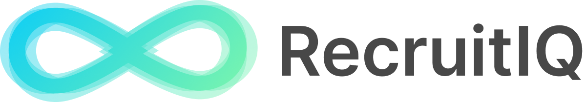
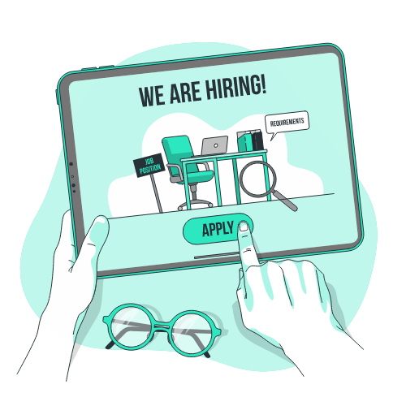

Empowering Recruitment. Enhancing Careers ✨  ✨ 
 
 

# AI-Driven Agentic Job Search and Recruitment

🚀 Welcome to **RecruitIQ**, the ultimate AI-powered platform designed to revolutionize the recruitment process and job search experience. Whether you're a job seeker aiming for your dream role or a recruiter looking to streamline candidate evaluation, RecruitIQ has got you covered.

     
    
     
    <h2>🎯 <strong>For Job Seekers</strong></h2>
    
<strong>Job seekers are individuals actively seeking employment opportunities. RecruitIQ empowers them with tailored tools to enhance their job search process and interview preparation.</strong>

- **AI-Powered Practice Interviews**: Simulate real interview scenarios tailored to your industry and role.
- **Resume Screening**: Compare your resume against job descriptions to identify strengths and areas for improvement.
- **Job Description Analysis**: Import job descriptions to uncover key requirements and prepare effectively.
- **Actionable Feedback**: Receive detailed insights to refine your interview performance and job application.

_🌟 How it works?_

1. **Sign Up**: Create an account using your email or social login with one of the supported providers.
2. **Import Job Descriptions**: Upload or paste job descriptions to get started.
3. **Screen Your Resume**: Analyze your resume for alignment with job requirements.
4. **Practice Interviews**: Engage in AI-powered interview simulations and receive actionable feedback.

     
    
     
    <h2>🤝 <strong>For Recruiters</strong></h2>
    
<strong>Recruiters are HR professionals and hiring managers responsible for finding the best talent. RecruitIQ equips them with powerful AI tools to streamline the recruitment process and make data-driven hiring decisions.</strong>

- **Job Description Generation**: Create compelling job descriptions in minutes with AI assistance.
- **Resume Screening**: Analyze multiple resumes efficiently to identify top candidates.
- **AI Screening Interviews**: Generate AI-driven interviews and share links with candidates for seamless evaluation.
- **Performance Metrics**: Leverage detailed candidate assessments to make informed hiring decisions.

_🌟 How it works?_

1. **Sign Up**: Access RecruitIQ's recruiter tools.
2. **Generate Job Descriptions**: Use AI to craft professional job descriptions effortlessly.
3. **Screen Resumes**: Upload candidate resumes and receive instant analysis.
4. **Create AI Interviews**: Share interview links with candidates and assess their performance.

## 🌟 **Features**

Discover how RecruitIQ empowers job seekers and recruiters with intuitive workflows and real-time AI solutions.

### 🖥️ Intuitive Workflow

Easily create job descriptions, screen resumes, and set up AI interviews with a streamlined and user-friendly interface.

### 📊 Job and Resume Insights

Get detailed insights into job requirements and candidate profiles with AI-driven analysis for smarter hiring decisions.

### 🎙️ AI Interviews with Suitable Voices and Personas

Simulate realistic interviews with tailored voices and personas, offering an authentic experience for job seekers.

### 📈 Real-Time Assessments and Results Sharing

- **Resume Assessment**: Get immediate feedback and actionable insights on candidate resumes.
- **AI Interview Assessment**: Evaluate performance instantly with detailed analysis.
- **Results Sharing**: Seamlessly share AI results and resume screenings with relevant stakeholders.

> _Replace placeholders with actual images showcasing RecruitIQ's cutting-edge capabilities._

## 📩 **Contact Us**

For inquiries, assistance, or further details, please reach out to us:

- **Email**: [hello@recruitiq.ai](mailto:hello@recruitiq.ai)
- **Support Hours**: Monday to Friday, 9 AM - 6 PM (EST)
- **Website**: [RecruitIQ](https://www.recruitiq.ai)

### 🌐 **Social**

- **GitHub**: [RecruitIQ](https://github.com/recruitiq)
- **Twitter**: [@recruitiqai](https://twitter.com/recruitiqai)
- **Reddit**: [r/recruitiq](https://reddit.com/r/recruitiq)
- **LinkedIn**: [RecruitIQ](https://www.linkedin.com/company/recruitiqai)

## 🌟 **Why RecruitIQ?**

Join thousands of job seekers and recruiters transforming their journey with RecruitIQ's AI-powered tools. Elevate your experience, save time, and achieve your goals seamlessly.
