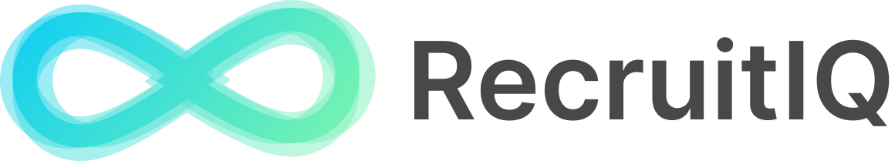

 

 
Empowering Recruitment. Enhancing Careers ✨  ✨ 
 
 

# AI-Driven Agentic Job Search and Recruitment

🚀 Welcome to **RecruitIQ**, the ultimate AI-powered platform designed to revolutionize the recruitment process and job search experience. Whether you're a job seeker aiming for your dream role or a recruiter looking to streamline candidate evaluation, RecruitIQ has got you covered.

## 📩 **Contact Us**

For inquiries, assistance, or further details, please reach out to us:

- **Email**: [hello@recruitiq.ai](mailto:hello@recruitiq.ai)
- **Support Hours**: Monday to Friday, 9 AM - 6 PM (EST)
- **Website**: [RecruitIQ](https://www.recruitiq.ai)

### 🌐 **Social**

- **GitHub**: [RecruitIQ](https://github.com/recruitiq)
- **Twitter**: [@recruitiqai](https://twitter.com/recruitiqai)
- **Reddit**: [r/recruitiq](https://reddit.com/r/recruitiq)
- **LinkedIn**: [RecruitIQ](https://www.linkedin.com/company/recruitiqai)

## 🌟 **Why RecruitIQ?**

Join thousands of job seekers and recruiters transforming their journey with RecruitIQ's AI-powered tools. Elevate your experience, save time, and achieve your goals seamlessly.
